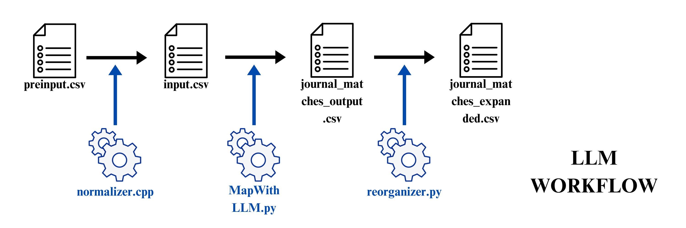

# JournalNameMatcher
Map your Journal Abbreviations to Full Name



A program to map journal abbreviations to their full journal names using fine tuned Large Language Model.

## Requirements

- **OS**: Ubuntu 24.04 (or compatible Linux)
- **Python**: 3.8+
- **C++ Compiler**: `g++` (for the normalizer)
- **Python Packages**:
  - `pandas`
  - `openai`
- **LLM**:  
  - **Recommended**: [Meta-Llama-3-8B-Instruct](https://huggingface.co/QuantFactory/Meta-Llama-3-8B-Instruct-GGUF) running locally (e.g., via [OpenAI-compatible API server](https://github.com/jmorganca/ollama) or similar)
  - **Alternative**: OpenAI API (GPT-3.5/4)


## Usage

1. **Clone the repository:**
   ```sh
   git clone https://github.com/Bill092738/JournalNameMatcher.git
   cd JournalNameMatcher
   ```

2. **Install Python dependencies:**
    ```sh
    pip install pandas openai
    ```
    or globally (not recommend)
    ```sh
    sudo apt install python3-pandas python3-openai
    ```
3. **Compile and run the normalizer (C++):**
    ```sh
    g++ -O3 -march=native -funroll-loops -flto -s -pipe -o normalizer normalizer.cpp
    ./normalizer
    ```
4. **Mapping using MapWithLLM.py**
    - Make sure you have a valid API to connect.
    - For local setup, please refer to [llama.cpp](https://github.com/ggml-org/llama.cpp) .
    - Defult API in code is set to `127.0.0.1:8080` with no API key.
    ```sh
    python3 MapWithLLM.py
    ```
5. **Get full response**
    ```sh
    python3 reorganizer.py
    ```
    - Your results will be in `journal_matches_expanded.csv`

## Verification
- Model: Meta-Llama-3-8B-Instruct.Q6_K
- Backend: llama.cpp on SYCL
- GPU: Intel Arc A580 with 8G of VRAM